# FIFA Overall Player Ratings Prediction Using Regression Methods

Awwal Mohammed <br>
International University of Malaya-Wales &copy; 2020-2022

## Introduction


This report covers basic approaches to using <b>easily-understood machine learning techniques</b> to predict 
"overall player ratings" [<sup id="fn1-back">1</sup>](#fn1 "see footnote on clarification of overall ratings in FIFA") 
based on data obtained from the FIFA video games, with initial inference from real life football data. 

<b>KNN Regression, Multiple Linear Regression, Voting Regressor, and Gradient Boosting Regressor</b> 
algorithmic models are used in this research. Evaluation methods such as <b>Lasso, Ridge, Cross-Validation, 
and Multiple KNN value comparison</b> are explored.

FIFA ratings are an aggregate, weighted metric which serves as a player’s overall beneficiary. 
It lies within the range of 0-99 with the provision that the higher the number, the better. 
For example, Cristiano Ronaldo may be rated 93 while Lionel Messi may be rated 94.

This report aims to tackle the following:
    <ol>
    <li>
        Predicting FIFA overall ratings of outfield players[<sup id="fn2-back">2</sup>](#fn2) from <i>FIFA 20</i>, 
        and crosschecking it against existing results.</li>
    <li>Identifying the feature(s) that influence(s) the ratings the most.</li>
    </ol>

This is a <b>supervised learning</b> exercise. The report culminates with a summary of the 
performance of each algorithm in predicting the overall ratings.

<hr>
<small>

[<sup id="fn1">1</sup>](#fn1-back) The FIFA video games consist of several ratings for each player. 
The aggregate of a given set of ratings is referred to as the overall rating, 
which is what this research intends to investigate.
<br>
[<sup id="fn2">2</sup>](#fn2-back) Goalkeeprs are precluded from this report as thier characteristics 
are completely different from outfield players.

</small>

<hr>


## Preprocessing

### The Datasets

While this research focuses on FIFA 20, there's an additional dataset introduced to cover grounds 
for investigative knowledge bias. One dataset has information pertaining to real life European football players 
statistics for inference (<b>You can completely ignore this, 
and subsequent related activities if you're not curious about it.</b>),
while the other contains data to be used for training and learning.

1. __European Soccer Dataset (Optional Inferential Dataset)__
    * This dataset has 25,000 match records, 10,000 players, 11 European countries with their leagues team line
    * with squad formation, detailed match events (
   goal types, possession, corner, cross, fouls, cards etc…) for +10,000 matches.

    
2. __FIFA 15-20 Complete Player Dataset (Core Dataset)__
    * The FIFA 20 subset is used as the core dataset. The datasets include the players' data 
   from FIFA 15 to FIFA 20, all the expected features necessary for the machine learning excercise. 


### Converting SQLite _European Soccer Dataset_ to CSV File

This conversion is due to programming convenience and familiarity.
 
⚠ Prerequisites for this section: 

1. Obtain the <i>European Soccer Dataset</i> from Kaggle <a href="https://www.kaggle.com/hugomathien/soccer#database.sqlite">here</a>.

2. You may save it in the path <code>{current_path}/Datasets/european-soccer/</code>.

3. The resulting dataset should be an SQLite file called <code>database.sqlite</code>.

<code><a href="PreProcessSQLite.py">PreProcessSQLite.py</a></code> performs the neccesary conversion.


### Grouping the _FIFA 20_ Dataset into Outfield Players and Goalkeepers

It is imperative to separate outfield players from goalkeepers due to the latter's unique features, 
for this reason, outfield players will remain the target for this exercise.

Prerequisites for this section: 

1. Obtain the <i>FIFA 15-20 Complete Player Dataset </i> from Kaggle 
<a href="https://www.kaggle.com/stefanoleone992/fifa-20-complete-player-dataset#players_20.csv">here</a>.

2. You may save it in the path <code>{current_path}/Datasets/fifa-20-complete-player-dataset/</code>.

3. The resulting dataset should be a CSV file called <code>players_20.csv</code>.

To achieve this grouping, we convert the CSV to an SQLite file to quickyl run some queries over it, 
then convert the grouped files back to CSV format.

Once this is done, you can optionally run the resulting datasets briefly through Microsoft Excel's 
<b>Intelligent Suggestions</b> module for quick insights into the story the data might be trying to tell.

This is a visual representation of the procedure as described, 
which <code><a href="PlayerGroup.py">PlayerGroup.py</a></code> subsequently implements:
<hr>

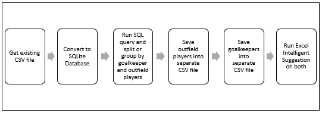 


### Additional Grouping/Trimming and Final Selection

Not quite there yet. Some unwanted features still need to be removed. To achieve this, 
you'll have to combine the resulting grouped CSV files as one, 
then convert into SQLite format (<a href="https://www.rebasedata.com">Rebasedata</a> and 
<a href="https://konbert.com">Konbert</a> can do this for you) to easily run some SQL queries over them for further trimming. 

This is a visual representation of the procedure as described, 
which <code><a href="TrimFeatures.py">TrimFeatures.py</a></code> implements:
<hr>

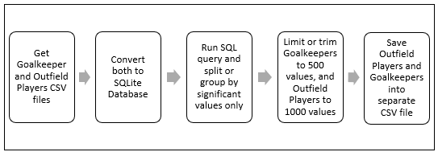


# Model Implementation

### KNN Regression

This is a visual representation of the KNN Regression model, 
which <code><a href="KNNReg.py">KNNReg.py</a></code> implements,
 with the subsequent output:
<hr>

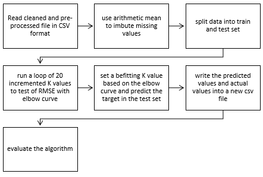


    Automatically created module for IPython interactive environment
    sofifa_id            0
    age                  0
    overall              0
    value_eur            0
    wage_eur             0
                        ..
    team_position_RS     0
    team_position_RW     0
    team_position_RWB    0
    team_position_ST     0
    team_position_SUB    0
    Length: 1036, dtype: int64
    RMSE value for k=  1 is: 1.5700318468107581
    RMSE value for k=  2 is: 1.4832396974191326
    RMSE value for k=  3 is: 1.4001983986405482
    RMSE value for k=  4 is: 1.3722700171613458
    RMSE value for k=  5 is: 1.3862900129482285
    RMSE value for k=  6 is: 1.3676825492619096
    RMSE value for k=  7 is: 1.3646783279496708
    RMSE value for k=  8 is: 1.3583940426106116
    RMSE value for k=  9 is: 1.3515880006336216
    RMSE value for k=  10 is: 1.3473863588444108
    RMSE value for k=  11 is: 1.3475260466057761
    RMSE value for k=  12 is: 1.357016232605769
    RMSE value for k=  13 is: 1.3537041009391264
    RMSE value for k=  14 is: 1.3498299212591676
    RMSE value for k=  15 is: 1.3435773144854743
    RMSE value for k=  16 is: 1.3486828064819392
    RMSE value for k=  17 is: 1.356784821518547
    RMSE value for k=  18 is: 1.360447684122609
    RMSE value for k=  19 is: 1.3614244210728814
    RMSE value for k=  20 is: 1.3570740584065408
    predictions: 
     [84.66666667 78.22222222 79.55555556 80.88888889 78.55555556 81.22222222
     78.44444444 79.22222222 83.66666667 81.55555556 79.11111111 78.55555556
     83.77777778 84.         78.88888889 78.88888889 78.33333333 78.55555556
     78.22222222 79.66666667 78.55555556 82.55555556 78.55555556 85.77777778
     81.88888889 79.55555556 79.66666667 78.77777778 80.         78.33333333
     79.11111111 80.66666667 78.33333333 79.66666667 78.55555556 78.55555556
     79.88888889 83.88888889 78.33333333 80.11111111 78.44444444 86.22222222
     84.88888889 78.77777778 80.55555556 85.22222222 78.11111111 83.
     81.55555556 80.55555556 80.11111111 79.88888889 78.         83.55555556
     83.44444444 79.77777778 78.66666667 83.33333333 82.66666667 81.33333333
     78.         78.         77.55555556 79.44444444 77.55555556 78.44444444
     81.88888889 79.88888889 77.88888889 77.77777778 78.44444444 78.77777778
     83.44444444 79.11111111 78.11111111 82.66666667 79.77777778 80.
     81.44444444 83.66666667 81.66666667 78.55555556 78.         78.88888889
     78.22222222 77.44444444 79.         83.44444444 82.44444444 78.55555556
     81.77777778 85.55555556 78.33333333 78.88888889 83.         77.77777778
     80.         90.         78.55555556 78.22222222 79.44444444 79.44444444
     89.66666667 78.22222222 78.11111111 79.         78.66666667 78.88888889
     83.11111111 79.88888889 78.55555556 77.77777778 77.77777778 79.22222222
     81.66666667 82.66666667 83.44444444 78.33333333 79.11111111 78.33333333
     79.55555556 88.33333333 78.33333333 79.66666667 79.22222222 79.77777778
     82.88888889 77.77777778 79.11111111 78.11111111 78.88888889 79.55555556
     83.22222222 84.33333333 79.11111111 78.88888889 78.33333333 78.88888889
     78.55555556 78.11111111 77.77777778 82.44444444 79.         78.
     79.11111111 78.88888889 79.11111111 84.         78.88888889 78.22222222
     86.44444444 77.66666667 82.55555556 78.88888889 80.22222222 90.
     87.66666667 77.77777778 81.77777778 78.         78.33333333 78.22222222
     78.66666667 78.44444444 83.44444444 78.55555556 86.88888889 86.55555556
     78.22222222 78.11111111 77.77777778 79.88888889 79.66666667 78.77777778
     85.22222222 78.77777778 78.         79.11111111 77.88888889 79.11111111
     77.77777778 81.         78.33333333 82.66666667 81.77777778 78.
     80.         78.33333333 78.33333333 82.22222222 79.22222222 79.
     78.         78.11111111 78.55555556 83.33333333 78.44444444 78.55555556
     80.77777778 78.77777778] 
    
    93     85
    613    79
    494    80
    376    80
    999    77
           ..
    89     85
    256    82
    341    81
    509    79
    464    80
    Name: overall, Length: 200, dtype: int64 
    
    score:  0.7863803120519212 
    
    


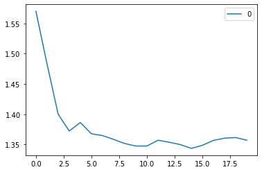


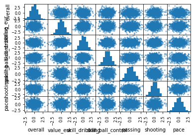


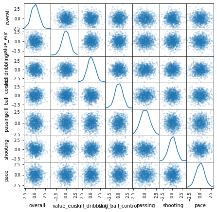


### KNN Regression with testing vs. training accuracy and multiple k-value evaluation
This is implemented in <code><a href="KNNRegTest.py">KNNRegTest.py</a></code>.

    Automatically created module for IPython interactive environment
    sofifa_id            0
    age                  0
    overall              0
    value_eur            0
    wage_eur             0
                        ..
    team_position_RS     0
    team_position_RW     0
    team_position_RWB    0
    team_position_ST     0
    team_position_SUB    0
    Length: 1036, dtype: int64
    RMSE value for k=  1 is: 1.5700318468107581
    RMSE value for k=  2 is: 1.4718186029535025
    RMSE value for k=  3 is: 1.4306175822583291
    RMSE value for k=  4 is: 1.4004463574160917
    RMSE value for k=  5 is: 1.398427688513067
    RMSE value for k=  6 is: 1.3884943884174201
    RMSE value for k=  7 is: 1.3890240297064842
    RMSE value for k=  8 is: 1.3700764121026243
    RMSE value for k=  9 is: 1.3700950674413659
    RMSE value for k=  10 is: 1.3699999999999994
    RMSE value for k=  11 is: 1.3755840232274716
    RMSE value for k=  12 is: 1.3712828543618074
    RMSE value for k=  13 is: 1.3695872483230962
    RMSE value for k=  14 is: 1.3795240971776737
    RMSE value for k=  15 is: 1.3788320339250097
    RMSE value for k=  16 is: 1.376263623910768
    RMSE value for k=  17 is: 1.3793271013777533
    RMSE value for k=  18 is: 1.3878051327256837
    RMSE value for k=  19 is: 1.384630714691279
    RMSE value for k=  20 is: 1.3872499774734186
    predictions: 
     [80.33333333 83.         79.33333333 81.66666667 78.33333333 79.
     80.33333333 79.66666667 78.         78.         79.66666667 78.
     77.33333333 86.66666667 83.         81.33333333 78.         83.
     82.33333333 78.         78.         79.66666667 82.33333333 81.
     77.         82.         78.         87.33333333 78.66666667 79.33333333
     81.66666667 80.66666667 83.         78.33333333 87.66666667 81.33333333
     79.33333333 79.         83.66666667 83.66666667 84.66666667 80.
     78.33333333 77.66666667 77.66666667 80.         83.         79.
     80.         81.66666667 83.33333333 79.66666667 81.33333333 79.66666667
     77.66666667 79.33333333 78.         88.33333333 85.         78.66666667
     77.66666667 82.         79.33333333 77.33333333 77.         78.
     85.66666667 78.33333333 78.         83.66666667 83.         78.
     83.         84.33333333 79.         81.33333333 78.66666667 79.
     83.         81.         78.33333333 85.66666667 77.66666667 79.
     82.         83.66666667 78.66666667 79.66666667 79.33333333 79.
     79.33333333 79.66666667 79.         83.         80.         77.
     77.66666667 77.66666667 79.         78.33333333 91.33333333 81.33333333
     85.66666667 78.33333333 83.         82.66666667 77.66666667 77.33333333
     79.         77.33333333 77.66666667 84.33333333 78.33333333 78.33333333
     78.         78.33333333 77.66666667 80.         85.33333333 85.33333333
     79.         78.         78.         79.66666667 77.33333333 83.66666667
     78.         78.66666667 82.         77.66666667 78.33333333 80.33333333
     80.33333333 83.66666667 83.         79.         83.         90.
     77.66666667 80.33333333 80.33333333 78.33333333 78.33333333 80.33333333
     82.         81.66666667 78.66666667 83.         88.33333333 80.33333333
     78.         78.33333333 77.66666667 83.         79.66666667 79.66666667
     81.33333333 82.33333333 79.66666667 79.33333333 79.         78.33333333
     78.         78.66666667 79.33333333 79.66666667 83.66666667 78.66666667
     78.66666667 80.33333333 78.33333333 78.         83.         78.
     78.         79.         81.33333333 83.33333333 78.         78.33333333
     77.         86.         80.33333333 78.66666667 79.33333333 79.
     77.66666667 78.66666667 91.33333333 80.         78.33333333 78.
     89.         78.66666667 85.66666667 79.         79.66666667 78.66666667
     83.33333333 83.66666667] 
    
    271    82
    57     86
    250    82
    268    82
    498    80
           ..
    503    80
    348    81
    700    78
    90     85
    187    83
    Name: overall, Length: 200, dtype: int64 
    
    score:  0.7843321144936547 
    
    


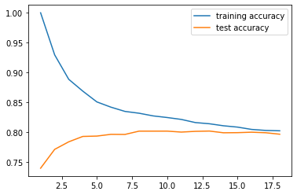


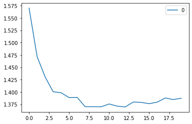


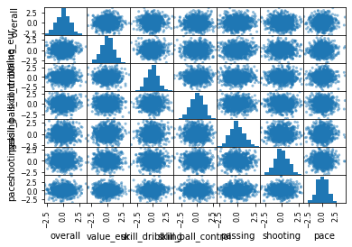


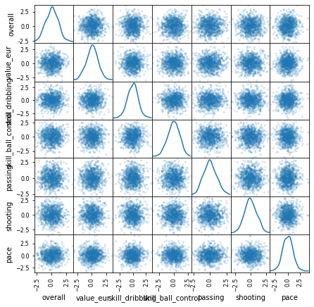


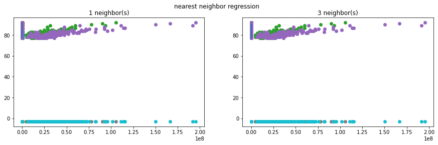


<hr>

### Multiple Linear Regression (MLR)

This is a visual representation of the MLR model, 
which <code><a href="MLReg.py">MLReg.py</a></code> subsequently implements:
<hr>

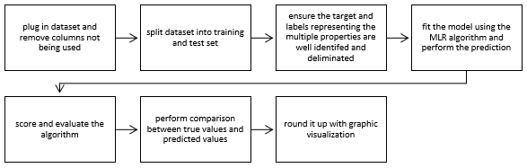


    Automatically created module for IPython interactive environment
    sofifa_id            0
    age                  0
    overall              0
    value_eur            0
    wage_eur             0
                        ..
    team_position_RS     0
    team_position_RW     0
    team_position_RWB    0
    team_position_ST     0
    team_position_SUB    0
    Length: 1036, dtype: int64
    predicted values:
    
     [86.8747943  79.98287891 79.26993736 79.18332689 79.67756544 80.60501831
     80.52276787 79.29888782 80.28082223 78.12278117 79.6012055  80.21880171
     79.34236509 80.01603953 81.55328082 80.1751625  78.29607511 79.04708373
     78.99171736 78.43517057 82.28184572 78.90349655 80.00990784 78.13109112
     78.40954873 77.88751127 79.03719414 78.30889441 80.79354622 80.75094826
     79.95673579 78.42026576 79.43704207 80.19447842 81.57691416 78.37510851
     80.03805467 81.60567414 78.34112407 80.06318956 79.0295774  77.52133698
     79.10315286 78.45721869 76.70407925 79.20363191 79.0899063  81.02318519
     78.73865861 78.88245809 78.62692699 78.04434026 83.67718072 80.00887928
     78.39601612 78.20699869 84.03526274 89.10538422 79.61438461 79.76556191
     77.50886018 80.86960944 79.65229288 78.7759495  80.78806178 80.18113942
     80.37753506 84.05407105 87.22970394 78.35125693 80.29624459 78.06141034
     78.25784608 82.93970308 79.27280813 78.44266091 87.38093126 77.67930806
     79.55207892 77.72399259 80.53090342 80.55093246 81.16288182 82.16377855
     96.91288402 78.86621444 78.48639451 83.53253542 79.33765381 80.54401786
     81.87619389 79.28763294 80.33273613 79.11719214 91.58374862 77.76259762
     83.16961109 85.57175401 77.08213524 79.33741596 95.0694012  80.47219572
     79.77821668 77.54980461 80.17510672 80.25218474 88.58374993 79.5192633
     79.7607276  79.89006017 79.68248429 78.36850084 77.26642242 80.00992079
     78.84233939 79.8116052  81.50129592 81.13023537 82.81474215 79.00844263
     79.71370357 80.39037457 79.68971909 83.05315921 80.89104015 78.58593234
     79.18882001 89.96442373 80.08217066 78.80075642 78.45946475 77.13835189
     77.90239693 81.93584849 83.38431464 78.72713548 78.02919278 79.48799374
     82.49463363 78.45865454 77.70564695 79.11573473 78.9234846  77.23354311
     81.84524116 83.95840705 79.48622504 83.31858105 81.34200108 81.29536291
     79.22843531 78.87804549 81.45809371 78.90036286 80.12059674 78.86754744
     78.00698225 81.97069033 80.92848317 80.61446849 83.59708188 79.38641171
     82.43287793 79.28820253 81.95752266 84.2907566  82.46222136 80.19084413
     80.19315988 80.23974539 78.06477574 79.06676931 78.60883052 82.18218672
     82.7180019  78.5318587  92.42876462 78.4452741  78.55158694 84.9763761
     81.20648969 79.75411203 81.79719949 79.63294568 80.27402199 81.98106764
     82.10545967 78.91899684 78.09562845 81.52371728 82.49728332 80.70055312
     77.87706404 79.85673253 79.32684502 81.76385193 81.70596012 83.072761
     78.05336621 77.36345795] 
    
    
    
    


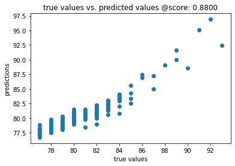


### Multiple Linear Regression with Ridge Regression and Cross-Validation Evaluation

This is implemented in <code><a href="MLRegEval.py">MLRegEval.py</a></code>.


    Automatically created module for IPython interactive environment
    sofifa_id            0
    age                  0
    overall              0
    value_eur            0
    wage_eur             0
                        ..
    team_position_RS     0
    team_position_RW     0
    team_position_RWB    0
    team_position_ST     0
    team_position_SUB    0
    Length: 1036, dtype: int64
    

    predicted values:
    
     [79.40361188 83.55486616 81.26935389 80.42627552 78.96459486 77.67666383
     78.73827333 79.41593791 77.77116033 78.16103164 97.4660832  77.23137748
     86.81600328 76.81955798 80.05663759 78.96210958 80.27110505 81.04851716
     78.68319823 78.45633012 81.80349478 81.4980994  79.13071163 79.89028273
     77.32858504 80.00879513 82.87576176 80.12204373 77.2806339  79.79710615
     81.62573841 78.56275373 78.32515851 83.12310018 79.84451354 78.1694399
     79.21211357 78.36624133 83.71347022 80.08086447 84.79650572 81.79482146
     77.37925677 79.60018492 80.15336693 78.48446607 79.1487607  78.38785964
     79.98373812 78.34131857 80.94055847 85.41116137 79.8378149  80.91723177
     79.93314862 78.06396441 90.66206746 78.37770273 82.33729768 79.17513625
     77.35149402 79.15112245 78.84941524 78.6350503  78.02655455 79.88049548
     82.26505602 78.3163484  79.48591601 81.6581002  80.13699552 82.86257194
     80.40764975 80.03022497 78.87806953 79.99323897 81.18445367 83.14113558
     78.17952985 79.72807329 79.12030415 78.94076627 83.65470293 78.28088579
     79.38551553 78.48161506 81.77626225 78.78729366 79.60288408 77.39360559
     84.93322437 78.28501946 79.04618823 85.59028857 77.2222882  79.56884039
     80.9722789  83.93047723 79.43192999 79.61063578 79.22010825 79.53893457
     82.56982223 81.32809656 79.98885033 77.04719699 82.94436761 78.76803857
     84.45925102 78.11985891 81.35158585 80.98575625 79.64213251 79.94322338
     78.60185508 82.84114098 80.51287329 82.87912627 88.16969988 78.8077043
     81.28053633 84.46183976 80.06993357 82.16452983 81.33834315 78.01221207
     78.89213423 78.48444117 78.74473552 93.4422006  88.61192856 79.00350348
     81.04168014 78.23641009 81.72100382 78.82834833 78.13222522 81.94940254
     78.98629566 79.39420975 83.15449298 77.67136974 78.92474634 78.83530033
     81.72467206 78.8251622  82.55032577 79.37621408 78.18910526 90.52235784
     78.1714016  77.31157394 79.06599898 80.1302792  81.64796724 77.31921165
     78.11445321 79.53637569 80.24809392 79.65016543 92.85863224 79.44325882
     79.53725036 79.34232542 78.88990941 79.55587099 80.82808883 79.16443232
     84.88677667 77.68277603 77.39837335 80.11404591 82.28394053 78.33019422
     79.56867135 90.87860951 77.71333032 81.95247804 77.28671842 79.67124147
     77.80390413 79.23741156 80.60859116 79.72157188 80.6709539  78.99153519
     77.226052   78.5025757  83.14298659 80.5327565  78.88535612 77.60836817
     77.83411542 79.54316201 92.82923417 80.15032254 81.70800993 83.02083051
     79.52211637 83.29302473] 
    
    
    
    score:  0.8616732626399296 
    
    cross validation measured values
     [79.08913886 83.82119152 80.99591729 80.2216745  78.58090688 77.72066444
     77.43627201 79.26671555 77.93841185 78.30394704 96.56826366 78.27951058
     86.75621817 77.90873441 80.15142402 79.17811601 80.84911502 81.20145916
     78.80289615 78.48519971 81.59596556 81.08069728 78.60519142 79.73183797
     77.76516456 79.48521157 81.62868704 80.10090817 77.89670843 79.45573956
     81.31739567 79.28155965 78.2905625  82.62681717 80.60956486 77.13567079
     79.33043564 78.04629077 83.05276451 80.03226861 84.76425774 80.55965921
     77.38933779 79.25528963 80.77631364 79.23807994 79.94047221 78.46094429
     80.30061031 78.68442914 81.05741503 84.02140127 80.28283772 80.19884035
     79.1806556  77.84041901 89.87575603 78.89926629 81.50797431 80.06772229
     78.75858223 79.1366315  79.01726001 79.3170256  78.41535055 80.11663746
     81.91777393 78.89408009 79.61059849 81.33870787 80.15672202 82.25621448
     80.33483966 80.68801592 78.91526387 79.99729749 81.19460664 82.42893661
     78.08684368 80.29256109 79.22629444 78.87737393 82.81045078 78.90028803
     79.41719548 78.87213142 81.14030483 78.73717551 79.73727115 77.67397196
     85.01266236 78.44844494 78.71843055 83.9630373  77.39062557 79.72893076
     80.02139323 83.31152404 79.34241493 79.70393392 79.16319424 79.74044515
     81.05737023 80.8494603  79.78674586 77.76842696 81.9909123  78.98126758
     83.41068787 78.44373687 80.74778979 80.92530264 79.21160364 79.68123803
     78.90037982 81.97230435 80.16161501 81.92799225 85.67780237 78.79622781
     81.22473051 84.19925366 80.34619349 81.49552258 81.40796505 78.29971881
     79.19321256 78.39927242 78.8396382  91.41057265 87.44350615 79.44693594
     80.43540692 78.57190102 81.07935135 79.34488978 79.58831809 81.18767796
     79.68104556 79.3474458  82.63157986 79.15713248 79.44889476 79.66153342
     81.24538527 79.76829081 81.82946497 79.90661735 78.84097759 89.37033396
     79.19115155 77.72291951 79.29578174 80.45160543 80.92730325 77.90455148
     78.55791769 80.30838085 80.44002786 80.07305364 92.71038807 78.57125214
     80.16246932 79.53306883 78.14423982 79.11586393 81.23920678 79.50821902
     83.00116375 77.62975279 77.13185349 80.21600608 80.71167264 78.69294978
     80.20065501 90.65482664 77.21841349 77.23611875 77.50055592 79.06161376
     78.09282908 79.17411    79.53656241 79.12986282 80.36987396 77.88277873
     77.64657577 77.44234746 82.30924642 80.98135788 78.35044369 77.53676448
     78.69834324 81.92276809 90.98634074 79.38152221 80.5501763  82.21377907
     79.164157   83.07097474] 
    
    cross validation scores at every 10th interval:
     [0.83540359 0.80428478 0.86765576 0.64867744 0.91046375 0.72172856
     0.89447911 0.81609669 0.68839869 0.77260819] 
    
    


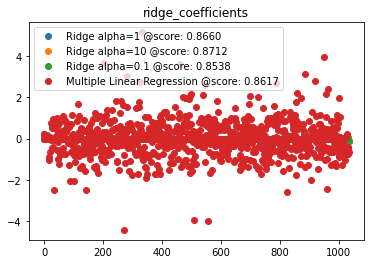


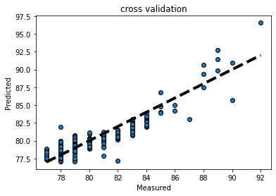


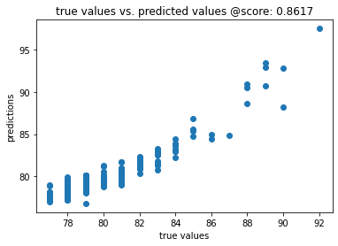


```python

```

<hr>

### Voting Regression Algorithm

This is a visual representation of the Voting Regression model, 
which <code><a href="VotingReg.py">VotingReg.py</a></code> implements:
<hr>

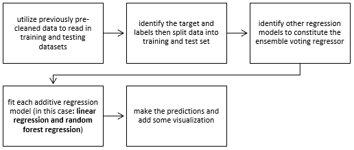


    Automatically created module for IPython interactive environment
    sofifa_id            0
    age                  0
    overall              0
    value_eur            0
    wage_eur             0
                        ..
    team_position_RS     0
    team_position_RW     0
    team_position_RWB    0
    team_position_ST     0
    team_position_SUB    0
    Length: 1036, dtype: int64 
    
    
    RandomForestRegressor Predictions:
     [77.1 78.4 79.6 83.4 83.2 78.1 84.5 78.2 77.6 77.1 78.1 78.  79.1 78.
     80.7 79.9 77.8 80.2 83.6 80.6 78.1 78.2 79.6 79.6 82.5 88.6 77.2 79.3
     78.1 81.8 79.3 88.8 86.1 79.  81.2 78.2 89.3 78.  83.8 79.6 79.9 78.2
     78.  78.1 79.4 82.3 77.1 89.3 80.  79.2 77.  83.  77.2 77.2 79.2 79.8
     82.2 78.9 82.5 83.7 81.6 79.3 78.1 78.1 78.  80.1 79.7 77.1 79.7 82.9
     78.4 83.7 77.3 78.4 79.4 77.7 77.  77.2 80.  81.4 78.7 80.6 79.3 79.3
     79.  80.  84.1 79.8 79.5 85.2 78.  79.6 84.7 81.1 86.1 82.4 78.7 78.
     79.2 79.5 79.9 81.3 82.5 78.5 78.1 77.1 79.1 82.1 78.6 79.4 78.4 78.9
     81.6 86.3 80.5 83.6 82.  87.4 78.5 77.8 81.6 77.1 83.8 78.1 80.6 78.1
     79.4 78.1 80.1 87.7 80.2 82.5 78.  83.9 91.2 78.2 80.5 78.5 78.1 86.2
     85.  81.  79.9 79.6 78.  86.5 77.  78.4 79.4 79.3 78.3 79.2 79.7 85.2
     80.2 80.2 77.2 78.2 82.9 77.4 81.9 79.9 78.4 77.1 79.3 79.2 82.1 80.
     81.1 78.  87.2 85.5 79.4 81.1 78.  83.7 77.9 82.9 79.  79.9 79.3 83.
     83.3 83.1 81.4 84.5 79.1 77.  82.5 80.2 81.7 79.9 78.9 78.5 81.5 78.9
     82.5 79.1 84.6 81.8] 
    
    Linear Regression Predictions:
     [78.03836684 78.75788189 80.3805173  82.90392869 83.29585635 78.89490794
     82.45084736 78.31622613 77.68986592 77.31412932 79.31727904 77.83087213
     77.56585883 78.4552804  79.60328697 79.88662966 78.63595091 79.38387256
     83.04672164 80.38932452 79.14339234 78.69824323 77.93508276 79.20566013
     81.76832845 90.21182395 77.76864644 79.34087261 78.58027771 81.1927403
     79.21209311 92.92481315 85.84749452 79.04314007 80.10917765 78.92308551
     92.68461335 78.91580508 83.1113927  79.79145235 80.13800859 78.54264552
     77.91572175 77.69298048 80.19708684 80.90788001 77.74558136 92.53787032
     79.88548843 79.45480313 77.23278525 82.56277232 78.4437192  78.45036348
     78.92710013 79.55791094 81.66993457 79.34723793 81.4120579  82.58996381
     82.03327102 78.98752069 78.1440222  77.76900082 78.87211662 80.01978968
     78.98321613 77.00474972 79.83448976 81.43079953 78.56732488 83.23826362
     77.55471234 79.21750731 79.08908676 77.64902032 77.83114085 76.80110644
     80.14959285 82.39615273 80.3790081  80.59053875 78.86678322 78.82294858
     78.85489377 79.29071045 83.15715507 78.78236543 78.43891291 85.52153112
     78.069948   79.50513422 84.85828545 80.8201056  84.00821609 81.43457539
     79.36584305 78.61644679 78.99869728 79.40334852 80.11925802 80.40682583
     81.55158233 79.53997527 79.50693303 77.44344485 79.31890433 82.1451289
     76.75236124 79.42851605 79.01554888 79.27204876 81.85232303 87.80343161
     79.99223174 83.01292018 82.15784367 89.38594477 77.16629057 77.35227191
     81.52091167 77.54975783 82.33171803 78.39208757 79.92825503 79.78559788
     79.05022805 78.3069711  80.21275063 90.59930479 80.06492639 81.9879527
     78.97582126 83.85590902 97.43840635 79.94164473 80.22613963 80.72847007
     79.04949028 85.00355795 84.90151608 80.25978307 79.40682983 79.55598935
     79.10043448 86.60667029 77.79023599 79.6559588  79.68533615 79.10553413
     78.94961754 78.25676928 79.18823376 85.46157113 81.35407524 79.43014979
     77.25845746 78.31820192 81.72879285 77.75951146 81.17928582 79.57246342
     77.67666327 77.47608848 79.10885883 81.59630826 82.23878869 79.65440451
     80.70255437 78.93048119 88.54737709 85.0654466  79.5512132  79.51123185
     79.7487101  82.90368887 78.78018286 82.28285973 79.06686076 79.28340752
     78.61179801 82.21390065 83.21908908 82.84143436 79.89298314 82.87648768
     79.9610413  76.96174788 82.77711252 79.89086537 81.14861375 80.6052213
     78.6683207  77.89406325 80.66017983 78.52518561 81.70803785 78.70725557
     83.83106035 80.6117924 ] 
    
    Voting Regressor Predictions:
     [77.56918342 78.57894095 79.99025865 83.15196434 83.24792818 78.49745397
     83.47542368 78.25811307 77.64493296 77.20706466 78.70863952 77.91543607
     78.33292942 78.2276402  80.15164349 79.89331483 78.21797545 79.79193628
     83.32336082 80.49466226 78.62169617 78.44912161 78.76754138 79.40283007
     82.13416422 89.40591197 77.48432322 79.32043631 78.34013886 81.49637015
     79.25604655 90.86240658 85.97374726 79.02157003 80.65458883 78.56154276
     90.99230667 78.45790254 83.45569635 79.69572617 80.01900429 78.37132276
     77.95786088 77.89649024 79.79854342 81.60394    77.42279068 90.91893516
     79.94274422 79.32740156 77.11639263 82.78138616 77.8218596  77.82518174
     79.06355006 79.67895547 81.93496729 79.12361897 81.95602895 83.14498191
     81.81663551 79.14376034 78.1220111  77.93450041 78.43605831 80.05989484
     79.34160807 77.05237486 79.76724488 82.16539977 78.48366244 83.46913181
     77.42735617 78.80875366 79.24454338 77.67451016 77.41557042 77.00055322
     80.07479642 81.89807637 79.53950405 80.59526938 79.08339161 79.06147429
     78.92744689 79.64535523 83.62857753 79.29118272 78.96945645 85.36076556
     78.034974   79.55256711 84.77914273 80.9600528  85.05410804 81.91728769
     79.03292153 78.30822339 79.09934864 79.45167426 80.00962901 80.85341292
     82.02579116 79.01998763 78.80346651 77.27172243 79.20945216 82.12256445
     77.67618062 79.41425802 78.70777444 79.08602438 81.72616151 87.0517158
     80.24611587 83.30646009 82.07892183 88.39297239 77.83314528 77.57613595
     81.56045584 77.32487892 83.06585902 78.24604379 80.26412751 78.94279894
     79.22511403 78.20348555 80.15637532 89.1496524  80.13246319 82.24397635
     78.48791063 83.87795451 94.31920317 79.07082236 80.36306982 79.61423503
     78.57474514 85.60177897 84.95075804 80.62989154 79.65341491 79.57799467
     78.55021724 86.55333515 77.395118   79.0279794  79.54266808 79.20276706
     78.62480877 78.72838464 79.44411688 85.33078556 80.77703762 79.8150749
     77.22922873 78.25910096 82.31439642 77.57975573 81.53964291 79.73623171
     78.03833163 77.28804424 79.20442942 80.39815413 82.16939435 79.82720225
     80.90127718 78.46524059 87.87368855 85.2827233  79.4756066  80.30561593
     78.87435505 83.30184443 78.34009143 82.59142987 79.03343038 79.59170376
     78.955899   82.60695033 83.25954454 82.97071718 80.64649157 83.68824384
     79.53052065 76.98087394 82.63855626 80.04543269 81.42430688 80.25261065
     78.78416035 78.19703162 81.08008991 78.7125928  82.10401892 78.90362778
     84.21553018 81.2058962 ] 
    
    


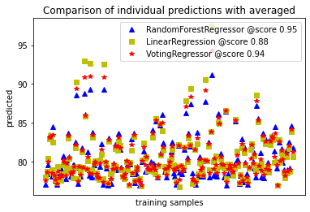


<hr>

### Gradient Boosting Regression (GBR) Algorithm

This is a visual representation of the GBR model, which <code><a href="GBR.py">GBR.py</a></code> implements:
<hr>

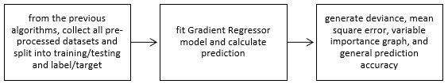


    Automatically created module for IPython interactive environment
    sofifa_id            0
    age                  0
    overall              0
    value_eur            0
    wage_eur             0
                        ..
    team_position_RS     0
    team_position_RW     0
    team_position_RWB    0
    team_position_ST     0
    team_position_SUB    0
    Length: 1036, dtype: int64 
    
    
    MSE: 0.3163
    size of prediction:  200
    prediction: 
     [77.50066071 80.28166753 83.31445071 83.94106728 77.56628816 82.04748441
     80.90129235 82.15505717 80.05711914 82.20841276 78.53161703 79.26524484
     78.54827103 79.85468865 77.61092536 77.28587469 79.94905361 81.86297481
     78.77746635 79.86319322 78.43557098 79.3266269  86.13456282 78.31285015
     77.43495862 85.26201168 85.5060164  77.5130349  81.19944164 79.46969341
     80.6592216  83.39882666 77.84822156 82.10207437 85.87807291 82.25905858
     77.86798187 78.27475122 79.05309264 87.87071948 77.46228843 83.96412312
     77.24764857 83.94333067 82.1354546  87.65383486 79.04751774 79.86771727
     80.16661881 78.8387045  82.24575361 78.56874647 89.48778287 78.8906047
     81.11172271 79.33231374 82.28744502 77.79663792 77.2501399  78.60015319
     77.44469501 82.96250222 79.85404315 77.22090607 78.2743279  78.38763939
     78.01734783 79.67180228 86.46634985 78.0259167  77.7755417  78.72465838
     79.88594339 78.31981828 83.05113843 78.19249458 77.14882744 81.3548976
     77.33279517 78.19106181 79.17693421 79.22502099 79.68512926 78.54160983
     84.51476788 77.4935367  78.30159344 85.03773847 82.02317544 79.53437061
     79.49703968 78.83153536 78.81653283 77.78965391 77.25507205 78.76247257
     79.1869876  81.82490134 86.01759127 79.49883842 78.35573612 78.20093623
     77.09192911 83.23322834 78.74506866 82.30301661 84.01836932 77.09045648
     77.00857863 79.91414467 78.61494809 80.75245044 83.54869157 78.48421261
     80.05918243 78.93763055 80.07493731 89.58083503 84.50994691 79.09247717
     80.69234627 79.67676377 79.12016482 83.00120896 79.05543383 79.70385982
     77.13686445 81.83966241 78.80526508 82.71278731 78.40441402 77.2585265
     78.25354423 79.47757313 77.2592911  79.85877906 78.50837313 79.24923496
     77.30182277 77.84623743 81.60059987 78.53042619 77.64705151 78.17631989
     87.25798996 77.18834078 84.16967432 78.7989075  86.53967546 81.39753561
     79.91475212 83.42456783 83.56030036 77.78314278 82.32831566 80.1248439
     84.88697932 78.55719757 80.15247011 78.427732   79.47073472 82.98286937
     78.09574948 80.38084754 77.37849072 78.48133298 82.23017174 80.62664838
     85.51626085 88.53508341 82.20420421 78.446413   79.0367478  78.9351531
     78.58657158 79.65101048 85.90143557 77.77731956 80.91362764 78.14178555
     82.45367028 82.15640929 79.27690007 79.71285012 82.1594059  77.98438734
     78.47671966 77.81387676 81.16954797 77.83113335 82.31143793 82.87862077
     88.24980231 78.5633741  78.72232146 83.93781777 77.55942918 79.12881541
     84.5657212  81.97213144]
    test score: 0.9642
    
    

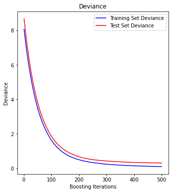


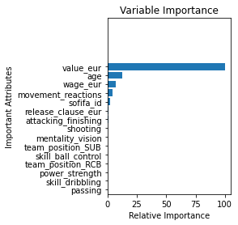


### Gradient Boosting with XGBoost evaluation

Prerequisites for this section: 

1. You most likely will encounter an error installing XGBoost via <code>pip</code>. 
2. You'll find instructions on the <a href="https://xgboost.readthedocs.io/en/latest/build.html">vendor's website</a>.

<code><a href="GBR_XGBoost.py">GBR_XGBoost.py</a></code> implements this evaluation.


    Automatically created module for IPython interactive environment
    sofifa_id            0
    age                  0
    overall              0
    value_eur            0
    wage_eur             0
                        ..
    team_position_RS     0
    team_position_RW     0
    team_position_RWB    0
    team_position_ST     0
    team_position_SUB    0
    Length: 1036, dtype: int64 
    
    
    MSE: 0.5716
    size of prediction:  200
    prediction: 
     [80.03222639 84.09668454 77.4990349  83.90897344 82.75383275 79.08834487
     84.58305946 89.5579993  77.86457629 78.67911865 80.87253465 78.36024874
     82.18699615 79.62991533 78.29861031 84.85317724 78.42132316 78.72223459
     82.310451   78.28817555 79.11350053 78.9786203  82.12323901 84.47856302
     78.30486517 79.39080017 78.52160768 82.16451208 77.64708466 84.03558402
     79.17416666 80.12226739 81.79389443 85.51204361 78.07534453 84.28879268
     81.95918051 79.13588716 80.99331227 78.73419168 77.13144436 79.46984439
     79.00573627 82.13973596 79.66391275 77.34965516 88.01157852 77.74126079
     77.45649445 89.27455075 80.26830984 77.81757566 78.98811374 77.42444373
     80.08777601 80.18912312 79.25385843 82.27037325 80.77382527 79.23805112
     77.12710556 77.43700652 78.31070568 84.85043363 79.19690423 86.82779088
     77.48798525 83.14243547 78.59483253 79.92419543 78.5991908  80.6732223
     78.10356097 78.50146965 80.07938471 82.55160325 82.87679393 78.11979762
     77.2203668  81.95982516 84.81777841 78.39617945 84.01292525 77.80269557
     81.20365214 79.08039902 78.84005939 79.43974147 79.40510677 78.34284183
     86.85758254 79.97198645 82.0095076  77.44057997 78.29609098 79.02671975
     78.29591132 81.43450791 84.73088187 77.15577228 78.03960032 82.58139374
     79.92627697 79.43682059 81.51273748 78.4977044  82.04990563 78.94958348
     83.1724797  77.89164883 78.26969192 82.4432361  77.5549681  79.49820752
     79.91824286 84.85586383 79.55528423 79.01372867 79.29515224 89.70541514
     82.39701381 78.01315304 81.78587048 79.3689853  90.62610548 88.92374345
     78.39089172 81.33968295 87.71122281 79.36390568 86.00138423 79.3174761
     77.17504858 79.09568792 79.34677587 80.28176461 80.10116818 78.99135755
     78.20928761 80.43413371 77.99559847 77.07870184 77.22699687 79.8173736
     79.25695813 78.55781575 79.09321119 81.30323944 79.17703957 82.02496929
     83.04925076 90.0804803  78.49530844 79.3867113  78.41856478 80.89064543
     77.28325627 78.36591959 78.51530599 78.30921988 77.68304834 78.96262263
     83.55328106 79.43232714 79.03043688 82.40277178 78.60538041 78.65725581
     79.02929328 83.33022268 78.06864695 78.40603654 81.10151935 77.22853695
     79.13065378 78.17660846 78.14502607 78.1200517  78.25065498 81.20491606
     77.5237754  80.68407877 80.70213674 80.21050993 78.3948194  79.23724727
     77.82331637 80.03810194 85.40056719 86.4962502  78.15580661 78.54686391
     79.080409   79.20619623 87.21497868 85.04668303 78.34278693 79.44005024
     81.51716489 78.01341495]
    test score: 0.9438


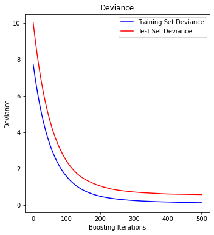


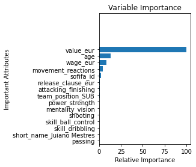


    XGB predictions:
     [79.83954  84.4557   77.47257  84.12741  83.20348  79.71965  84.507614
     89.625    78.0602   78.661    80.64833  78.12047  82.4132   79.83159
     78.38893  85.62745  78.54127  78.999245 82.55367  78.563034 79.382576
     79.468605 83.43974  84.006615 77.85358  79.73917  78.19146  82.58214
     77.62072  84.11112  79.54766  80.08623  81.31419  85.5844   78.25554
     84.378136 81.88007  78.74612  80.12361  78.14174  76.9646   79.90122
     78.03387  82.06241  80.692795 77.23939  88.83091  77.466995 77.07657
     89.121635 81.034294 77.63385  79.61537  76.92048  79.50215  80.21723
     79.386856 82.24164  81.00054  78.81714  76.97433  77.35805  77.87139
     84.98284  79.02129  86.419304 77.24919  82.99761  78.72895  79.58036
     78.10361  81.53009  77.98868  78.335884 79.988335 83.097336 83.42798
     77.75666  77.01154  81.84401  85.19378  78.474    83.81032  78.052536
     81.28176  79.183525 78.722916 79.9721   79.40503  77.88457  86.89866
     80.04575  83.17865  77.27263  78.17345  79.19656  78.13317  81.018196
     84.698654 76.94766  77.98242  83.193825 81.39867  79.4087   81.16841
     78.24879  82.1293   79.13059  83.393974 77.80798  77.89779  82.71875
     77.591385 79.13242  80.12771  84.70757  79.64734  79.000305 79.13862
     89.196785 82.98979  78.04829  81.712296 78.55921  90.49355  88.083244
     78.30779  81.04324  88.64356  78.98328  87.57836  79.71369  77.01918
     79.051926 78.898705 80.5618   80.590225 78.92508  78.23409  80.62751
     77.89316  76.95264  76.738014 79.87418  79.37796  78.22808  78.67744
     81.558495 79.19377  82.00043  83.21194  90.49752  79.06238  79.36658
     77.84551  81.10486  76.89615  78.581696 77.48683  78.50707  77.101974
     79.19367  84.44372  79.21375  79.4178   82.26863  78.20399  78.556244
     79.087    83.19202  77.80677  78.01735  80.80606  77.066    78.702385
     78.10479  77.89611  78.19101  78.05385  81.28604  77.4743   80.98116
     80.73555  80.46555  78.54537  79.23917  77.39644  80.081    85.877945
     86.48322  77.84128  78.39153  79.63295  79.049034 87.65402  85.10107
     78.00571  79.45789  81.05464  77.94737 ] 
    
    Accuracy: 75.50%
    


## Model Comparison

<code><a href="ModelComparison.py">ModelComparison.py</a></code> implements this procedure.


    Automatically created module for IPython interactive environment
    KNNReg| Mean = 0.630142 STD = 0.179611 Variance = 0.032260
    MLR| Mean = 0.812274 STD = 0.068709 Variance = 0.004721
    VReg| Mean = 0.857354 STD = 0.060742 Variance = 0.003690
    GBR| Mean = 0.854664 STD = 0.074611 Variance = 0.005567
    


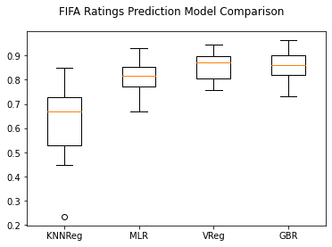

<hr>

## Conclusion

In this report, four simple regression-based algorithms and models were used to predict the overall player ratings 
from FIFA 20, of 200 outfield players based on a training data set consisting of 1000 players 
from which we removed the 200. The initial datasets had thousands of players and features 
but underwent pre-processing and cleaning.

The KNN regression model came out with an 81.66% accuracy; MLR, 88.93%; voting regressor, 95%; GBR, 95.94%. 

<b>The variable importance graph from the GBR algorithm shows that monetary features like wage, value, 
and players’ age, contribute the most to overall player ratings.</b>
